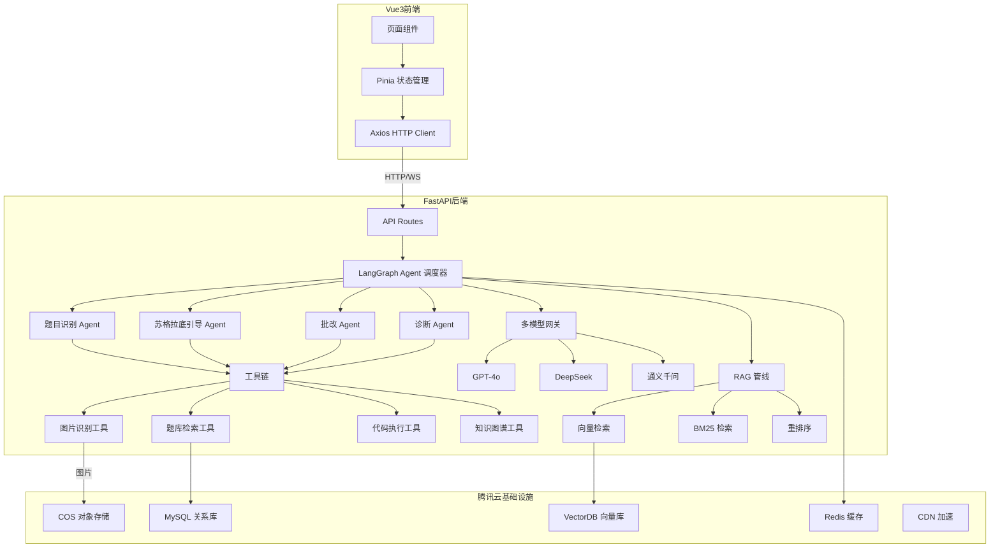

## 产品概述

TuringMate 是面向408计算机考研的 AI 1对1私教 Web 应用，核心差异在于用苏格拉底式引导教学替代"直接给答案"，帮助考生真正掌握解题能力。整体架构为：多模态大模型 Agent + RAG 知识库 + Agent 工具链 + Vue 3 前端，部署于腾讯云生态。

## 核心功能

- **拍照搜题**：拍教材题目自动识别（多模态 LLM / OCR），进入引导式讲解流程
- **手写批改**：拍草稿纸上传，Agent 定位具体哪一步出错并标注
- **引导式讲解**：苏格拉底式对话 Agent，通过反提问、给提示带学生自己推导
- **薄弱点诊断**：自动分析错题记录，RAG 检索关联知识点，输出弱点报告和专项练习
- **四科联动**：跨数据结构、计组、OS、网络四科关联知识点，知识图谱驱动
- **代码可视化**：算法题自动生成运行过程图示（数组、链表、树等），代码执行 Agent 驱动

## 架构特性

- **多模态 Agent**：统一模型网关，支持 GPT-4o / DeepSeek / 通义千问等多模型可插拔切换
- **RAG 知识库**：408 教材 PDF + 历年真题 + 结构化知识点数据，混合检索 + 重排序
- **Agent 工具链**：图片识别、题库检索、代码执行、知识图谱查询四大工具
- **腾讯云部署**：CVM/TKE + VectorDB + COS + MySQL + CDN

## 技术栈

### 前端

- **框架**：Vue 3 + TypeScript + Vite 5
- **状态管理**：Pinia
- **路由**：Vue Router 4
- **样式**：Tailwind CSS 3.4
- **组件库**：TDesign Vue Next
- **图表**：vue-echarts（ECharts 封装）
- **代码可视化**：自定义 Canvas/SVG 绘制算法执行过程
- **图标**：lucide-vue-next
- **HTTP**：Axios

### 后端

- **框架**：Python FastAPI
- **Agent 框架**：LangGraph（多 Agent 协作编排）
- **LLM 抽象**：LangChain（统一模型接口）
- **RAG 管线**：LangChain + RecursiveCharacterTextSplitter + Embeddings
- **向量数据库**：Chroma（开发阶段）→ 腾讯云 VectorDB（生产）
- **文档解析**：PyMuPDF（PDF 解析）
- **代码执行**：sandboxed Python executor
- **任务队列**：Celery + Redis（异步 Agent 执行）
- **数据验证**：Pydantic v2

### 部署

- **计算**：腾讯云 CVM / TKE 容器服务
- **向量数据库**：腾讯云 VectorDB
- **对象存储**：腾讯云 COS（图片、PDF 文档）
- **关系数据库**：腾讯云 MySQL（用户数据、错题记录）
- **缓存**：腾讯云 Redis
- **CDN**：腾讯云 CDN（静态资源加速）
- **容器化**：Docker + docker-compose

## 实现方案

### 整体策略

采用**前后端分离 + Agent 驱动**的全栈架构。前端 Vue 3 负责 UI 渲染和交互，通过 HTTP/WebSocket 与 Python 后端通信。后端以 FastAPI 为服务入口，LangGraph 编排多 Agent 协作，RAG 管线提供知识检索，工具链扩展 Agent 能力。前后端通过 OpenAPI 契约保持接口一致。

### 架构设计



### 核心流程：苏格拉底式引导讲解

1. 用户拍照/上传题目 → 前端上传图片至 COS → 获取 URL
2. 调用后端 `/api/question/parse` → 题目识别 Agent 调用多模态 LLM 解析图片
3. 调用后端 `/api/chat/start` → 苏格拉底引导 Agent 启动对话
4. 对话循环：学生回复 → Agent 判断理解程度 → 生成下一步引导提问（不直接给答案）
5. Agent 内部通过 RAG 检索相关知识点、知识图谱关联跨科内容
6. 对话结束 → 自动记录错题 → 更新薄弱点画像

### Agent 框架设计

使用 LangGraph 构建有状态的多 Agent 图：

- **Orchestrator（调度 Agent）**：根据用户意图路由到对应子 Agent
- **QuestionParser（题目识别）**：调用多模态 LLM 解析图片中的题目
- **SocraticTutor（苏格拉底引导）**：核心教学 Agent，状态机驱动引导流程
- 状态：QUESTION → HINT → PROBE → AFFIRM → EXTEND → COMPLETE
- 每个 Agent 步骤通过 RAG 检索辅助知识点
- **Corrector（批改 Agent）**：识别手写步骤中的错误
- **Diagnostician（诊断 Agent）**：分析错题模式，生成薄弱点报告

### RAG 管线设计

- **文档加载**：PyMuPDF 解析教材 PDF → Markdown 文本
- **文本分块**：RecursiveCharacterTextSplitter，chunk_size=500，overlap=50
- **Embedding**：可插拔模型接口，开发用 text2vec-base-chinese，生产可切云端模型
- **向量存储**：Chroma（开发）→ 腾讯云 VectorDB（生产），通过抽象层切换
- **检索策略**：混合检索 = 向量相似度(0.7) + BM25关键词(0.3) → Cohere Reranker 重排序
- **四科知识图谱**：预定义知识点节点和跨科关联边，Neo4j 或结构化 JSON

### 多模型网关设计

```python
# 统一接口，模型可插拔切换
class LLMGateway:
    async def chat(self, messages, model="deepseek", **kwargs) -> str
    async def chat_with_image(self, messages, image_url, model="gpt-4o", **kwargs) -> str
    async def stream_chat(self, messages, model="deepseek", **kwargs) -> AsyncIterator[str]
```

通过环境变量 / 配置文件指定默认模型，运行时可按场景切换（图片理解用多模态模型、引导推理用文本模型）。

### API 接口设计

| 路由 | 方法 | 说明 |
| --- | --- | --- |
| `/api/question/parse` | POST | 图片题目识别，返回结构化题目 |
| `/api/chat/start` | POST | 开始引导对话，传入题目ID |
| `/api/chat/message` | POST | 发送用户消息，返回AI引导回复 |
| `/api/chat/stream` | POST(WS) | 流式引导对话 |
| `/api/correction/analyze` | POST | 手写批改分析 |
| `/api/diagnosis/report` | GET | 获取薄弱点诊断报告 |
| `/api/diagnosis/practice` | GET | 获取专项练习推荐 |
| `/api/visualize/execute` | POST | 代码执行并生成步骤快照 |
| `/api/upload/image` | POST | 图片上传至 COS |


### 数据模型

- **User**：id, name, avatar, target_school, weak_subjects
- **Question**：id, subject, knowledge_tags[], difficulty, content, image_url, solution_steps[]
- **ChatSession**：id, user_id, question_id, status, messages[{role, content, timestamp}]
- **Mistake**：id, user_id, question_id, user_answer, error_step, knowledge_tags[]
- **DiagnosisReport**：user_id, scores{ds, co, os, cn}, weak_points[], recommendations[]
- **KnowledgeNode**：id, subject, name, related_nodes[], prerequisites[]

## 目录结构

```
TuringMate/
├── frontend/                         # Vue 3 前端项目
│   ├── public/
│   ├── src/
│   │   ├── api/                      # API 服务层
│   │   │   ├── index.ts              # Axios 实例 + 拦截器
│   │   │   ├── question.ts           # 题目相关 API
│   │   │   ├── chat.ts               # 引导对话 API
│   │   │   ├── correction.ts         # 手写批改 API
│   │   │   ├── diagnosis.ts          # 薄弱点诊断 API
│   │   │   └── visualization.ts      # 代码可视化 API
│   │   ├── assets/
│   │   │   ├── images/
│   │   │   └── styles/
│   │   │       └── global.css        # 全局 CSS 变量 + Tailwind 主题
│   │   ├── components/
│   │   │   ├── layout/
│   │   │   │   ├── AppHeader.vue     # 顶部导航栏
│   │   │   │   ├── AppSidebar.vue    # 侧边栏导航
│   │   │   │   └── AppLayout.vue     # 主布局容器
│   │   │   ├── chat/
│   │   │   │   ├── ChatBubble.vue    # 对话气泡
│   │   │   │   ├── ChatInput.vue     # 对话输入框
│   │   │   │   └── ChatPanel.vue     # 对话面板
│   │   │   ├── question/
│   │   │   │   ├── QuestionCard.vue  # 题目卡片
│   │   │   │   └── TopicTag.vue      # 知识点标签
│   │   │   ├── upload/
│   │   │   │   └── ImageUploader.vue # 图片上传组件
│   │   │   └── visualization/
│   │   │       ├── ArrayVisual.vue   # 数组可视化
│   │   │       ├── TreeVisual.vue    # 树结构可视化
│   │   │       └── CodeStepPlayer.vue # 步骤播放器
│   │   ├── composables/
│   │   │   ├── useChat.ts            # 对话逻辑
│   │   │   ├── useUpload.ts          # 图片上传逻辑
│   │   │   ├── useDiagnosis.ts       # 诊断数据分析
│   │   │   └── useVisualization.ts   # 可视化控制
│   │   ├── router/
│   │   │   └── index.ts              # 路由配置
│   │   ├── stores/
│   │   │   ├── user.ts               # 用户状态
│   │   │   ├── question.ts           # 题目状态
│   │   │   ├── chat.ts               # 对话状态
│   │   │   └── diagnosis.ts          # 诊断状态
│   │   ├── types/
│   │   │   ├── question.ts           # 题目类型
│   │   │   ├── chat.ts               # 对话类型
│   │   │   ├── diagnosis.ts          # 诊断类型
│   │   │   └── user.ts               # 用户类型
│   │   ├── views/
│   │   │   ├── HomeView.vue          # 首页
│   │   │   ├── PhotoSearchView.vue   # 拍照搜题
│   │   │   ├── GuidedChatView.vue    # 引导式对话
│   │   │   ├── CorrectionView.vue    # 手写批改
│   │   │   ├── DiagnosisView.vue     # 薄弱点诊断
│   │   │   └── CodeVisualView.vue    # 代码可视化
│   │   ├── App.vue
│   │   └── main.ts
│   ├── index.html
│   ├── package.json
│   ├── tsconfig.json
│   ├── vite.config.ts
│   ├── tailwind.config.ts
│   └── postcss.config.js
│
├── backend/                          # Python 后端项目
│   ├── app/
│   │   ├── __init__.py
│   │   ├── main.py                   # FastAPI 入口 + CORS + 生命周期
│   │   ├── config.py                 # 配置管理（Pydantic Settings）
│   │   ├── api/                      # API 路由层
│   │   │   ├── __init__.py
│   │   │   ├── deps.py              # 依赖注入
│   │   │   └── v1/
│   │   │       ├── __init__.py
│   │   │       ├── question.py      # 题目识别路由
│   │   │       ├── chat.py          # 引导对话路由
│   │   │       ├── correction.py    # 手写批改路由
│   │   │       ├── diagnosis.py     # 薄弱点诊断路由
│   │   │       └── visualization.py # 代码可视化路由
│   │   ├── agents/                   # Agent 模块
│   │   │   ├── __init__.py
│   │   │   ├── orchestrator.py      # 主调度 Agent（LangGraph StateGraph）
│   │   │   ├── question_parser.py   # 题目识别 Agent
│   │   │   ├── socratic_tutor.py    # 苏格拉底引导 Agent
│   │   │   ├── corrector.py         # 批改 Agent
│   │   │   └── diagnostician.py     # 诊断 Agent
│   │   ├── core/                     # 核心模块
│   │   │   ├── __init__.py
│   │   │   ├── llm_gateway.py       # 多模型网关（统一接口 + 模型切换）
│   │   │   └── tools.py             # Agent 工具注册基类
│   │   ├── rag/                      # RAG 子系统
│   │   │   ├── __init__.py
│   │   │   ├── loader.py            # 文档加载（PyMuPDF + 真题解析）
│   │   │   ├── splitter.py          # 文本分块策略
│   │   │   ├── embeddings.py        # Embedding 模型抽象
│   │   │   ├── vectorstore.py       # 向量存储抽象（Chroma/VectorDB）
│   │   │   └── retriever.py         # 混合检索 + 重排序
│   │   ├── tools/                    # Agent 工具实现
│   │   │   ├── __init__.py
│   │   │   ├── image_ocr.py         # 图片识别工具（多模态LLM/OCR）
│   │   │   ├── question_search.py   # 题库检索工具
│   │   │   ├── code_executor.py     # 代码执行工具（沙箱）
│   │   │   └── knowledge_graph.py    # 知识图谱查询工具
│   │   ├── models/                   # SQLAlchemy ORM 模型
│   │   │   ├── __init__.py
│   │   │   ├── user.py
│   │   │   ├── question.py
│   │   │   ├── chat.py
│   │   │   └── diagnosis.py
│   │   ├── schemas/                  # Pydantic 请求/响应 Schema
│   │   │   ├── __init__.py
│   │   │   ├── question.py
│   │   │   ├── chat.py
│   │   │   ├── correction.py
│   │   │   ├── diagnosis.py
│   │   │   └── visualization.py
│   │   └── services/                 # 业务逻辑层
│   │       ├── __init__.py
│   │       ├── question_service.py
│   │       ├── chat_service.py
│   │       ├── correction_service.py
│   │       └── diagnosis_service.py
│   ├── data/                         # 知识库原始数据
│   │   ├── textbooks/                # 408 教材 PDF
│   │   ├── exams/                    # 历年真题
│   │   └── knowledge/                # 结构化知识点 JSON
│   │       ├── ds_nodes.json         # 数据结构知识点
│   │       ├── co_nodes.json         # 计组知识点
│   │       ├── os_nodes.json         # OS 知识点
│   │       ├── cn_nodes.json         # 网络知识点
│   │       └── cross_subject_edges.json # 跨科关联
│   ├── alembic/                      # 数据库迁移
│   │   └── versions/
│   ├── tests/
│   ├── requirements.txt
│   ├── Dockerfile
│   └── .env.example
│
├── docker-compose.yml                # 编排前后端 + Redis + MySQL
├── .gitignore
└── README.md
```

## 实现备注

- **模型切换**：通过 `LLMGateway` 统一接口，配置文件指定默认模型，运行时按场景路由（图片理解走多模态、引导推理走文本模型），无需修改业务代码
- **RAG 切换**：`vectorstore.py` 抽象层统一接口，开发用 Chroma（本地文件），生产切腾讯云 VectorDB，仅改配置
- **Agent 流式输出**：苏格拉底式引导对话通过 SSE (Server-Sent Events) 流式返回，前端逐字渲染提升交互体验
- **图片上传流程**：前端直传 COS（通过后端签名 URL）→ 获取 COS URL → 传给 Agent 处理，避免后端中转大文件
- **代码执行安全**：sandbox 环境，限制执行时间 10s + 内存 256MB，禁止文件系统和网络访问
- **知识图谱**：MVP 阶段用结构化 JSON 表示，后续可迁移至 Neo4j 图数据库
- **前后端联调**：后端提供 `/docs` Swagger 文档，前端根据 OpenAPI schema 生成类型定义
- **性能关注点**：RAG 检索延迟控制在 500ms 内（预计算 embedding + 缓存热点查询）；Agent 对话首 token 延迟 < 2s；代码可视化 Canvas 防重绘用 requestAnimationFrame

## 设计风格

采用现代教育科技风格，融合 Glassmorphism 毛玻璃质感与清爽学术氛围。整体呈现"智能学长"的陪伴感——温暖但不随意，专业但不冰冷。

## 页面规划

### 1. 首页 HomeView

- **顶部导航栏**：Logo + 用户头像 + 设置入口，半透明毛玻璃效果，固定顶部
- **快捷功能区**：4 个圆形图标入口（拍照搜题、手写批改、薄弱点、代码可视化），卡片式排列带渐变底色，hover 微弹动
- **最近练习**：横向滚动卡片列表，展示最近题目和对话记录，含科目标签和进度条
- **学习统计**：3 个简洁数据卡片（今日练习数、正确率提升、连续学习天数），紫色渐变图标
- **底部导航栏**：首页、搜题、批改、诊断 4 个 tab，固定底部

### 2. 拍照搜题 PhotoSearchView

- **顶部导航**：返回 + 标题"拍照搜题"
- **拍照/上传区**：大面积虚线框 + 相机图标，点击触发拍照或选择图片，支持拖拽上传
- **图片预览区**：上传后显示缩略图，可裁剪/旋转
- **识别结果**：展示 OCR 识别的题目文本，可手动编辑修正
- **开始引导按钮**：底部固定主按钮，紫色渐变，进入对话页

### 3. 引导式对话 GuidedChatView

- **顶部**：题目缩略图 + 科目标签 + 折叠查看原题
- **对话区**：AI 气泡（左侧带头像）+ 用户气泡（右侧），AI 消息支持公式渲染
- **引导标记**：AI 提示类消息有特殊样式（灯泡图标 + 浅黄底色）
- **输入区**：文本输入框 + 发送按钮，支持快捷回复提示标签
- **底部工具栏**：跳过当前提示 / 显示关键步骤 / 结束对话

### 4. 手写批改 CorrectionView

- **顶部导航**：返回 + 标题"手写批改"
- **图片展示区**：草稿纸图片全宽展示，可缩放拖拽
- **批注层**：Canvas 覆盖层，红色标注错误步骤序号和箭头
- **步骤列表**：右侧/底部抽屉式面板，列出每一步判断
- **操作按钮**：重新拍照 / 开始引导订正

### 5. 薄弱点诊断 DiagnosisView

- **顶部导航**：返回 + 标题"薄弱点诊断"
- **雷达图区**：ECharts 四科雷达图，各 5 个知识维度
- **四科 Tab 切换**：数据结构 / 计组 / OS / 网络
- **弱点列表**：按严重程度排列的薄弱知识点卡片
- **专项练习推荐**：底部卡片组，展示针对性题目推荐

### 6. 代码可视化 CodeVisualView

- **顶部导航**：返回 + 标题"代码可视化"
- **代码区**：左侧代码面板，当前执行行高亮标注
- **可视化区**：右侧数据结构动态图示（数组色块变化、指针箭头移动、树节点高亮）
- **播放控制条**：上一步 / 播放暂停 / 下一步 / 速度调节，底部固定
- **步骤说明**：当前步骤的文字解释

## 响应式策略

- 桌面端（>1024px）：侧边栏常驻 + 内容区宽屏布局
- 平板端（768-1024px）：侧边栏收起为图标模式
- 移动端（<768px）：底部 Tab 导航，全宽内容区

## SubAgent

- **code-explorer**
- Purpose: 在实现过程中搜索和验证 Vue 3 + TDesign、LangGraph、FastAPI 的最佳实践和组件用法
- Expected outcome: 确保生成的代码符合 Vue 3 Composition API、TDesign 组件库、LangGraph Agent 框架的推荐模式