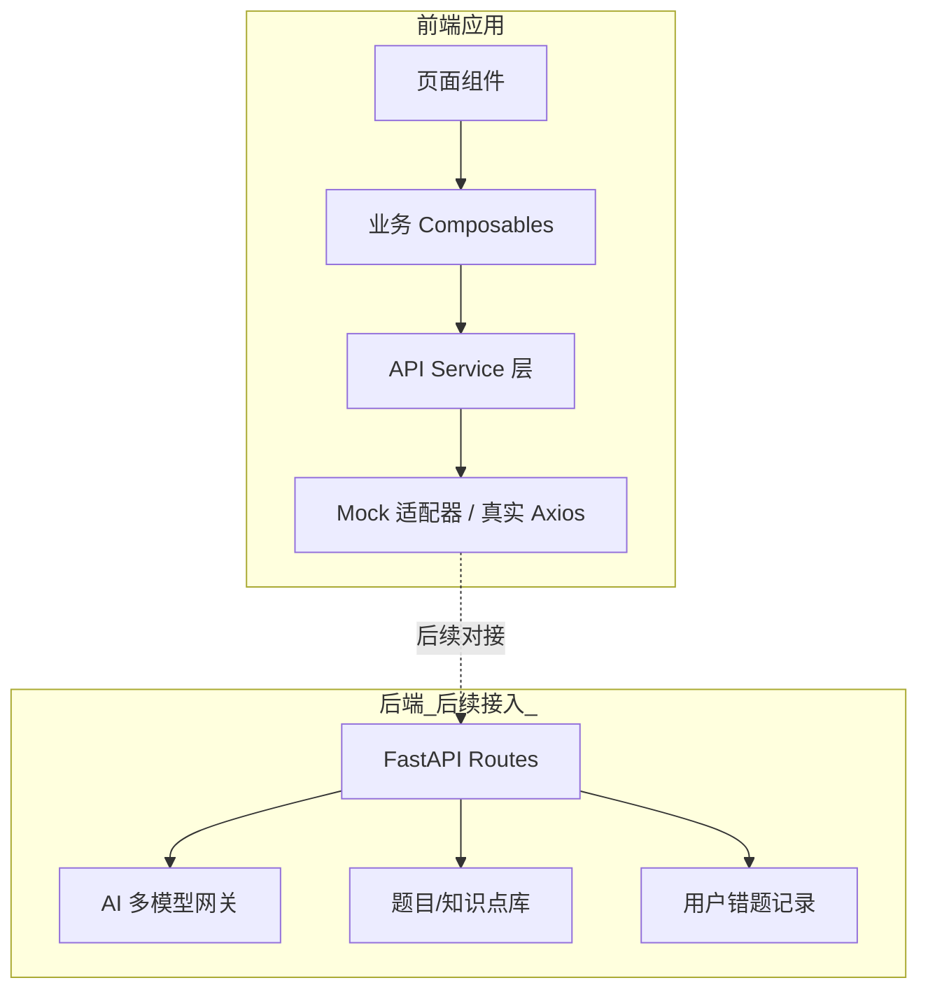

## 产品概述

TuringMate 是面向408计算机考研的 AI 1对1私教 Web 应用，核心差异在于用苏格拉底式引导教学替代"直接给答案"，帮助考生真正掌握解题能力。

## 核心功能

- **拍照搜题**：拍教材题目自动识别，进入引导式讲解流程
- **手写批改**：拍草稿纸上传，定位具体哪一步出错并标注
- **引导式讲解**：不直接给答案，通过反提问、给提示带学生自己推导
- **薄弱点诊断**：自动分析错题记录，输出弱点报告和专项练习推荐
- **四科联动**：跨数据结构、计组、OS、网络四科关联知识点
- **代码可视化**：算法题自动生成运行过程图示（数组、链表、树等）

## MVP 策略

先完成前端 UI 原型，使用 Mock 数据模拟后端交互，架构上预留 API 层便于后续对接 Python FastAPI 后端。

## 技术栈

- **前端框架**：Vue 3 + TypeScript + Vite
- **状态管理**：Pinia
- **路由**：Vue Router 4
- **样式方案**：Tailwind CSS
- **组件库**：TDesign Vue Next（企业级，中文生态完善）
- **图表库**：ECharts（薄弱点诊断雷达图等）
- **代码可视化**：D3.js / 自定义 Canvas 绘制算法执行过程
- **图片上传/裁剪**：Cropperjs
- **HTTP 层**：Axios（Mock 阶段使用 MSW 或本地 JSON）
- **后端（后续接入）**：Python FastAPI
- **AI 模型**：多模型切换（OpenAI / DeepSeek / 通义千问等，通过统一接口抽象）

## 实现方案

### 整体策略

采用**分层架构 + Mock API 层**的策略。前端按完整产品形态开发所有页面和交互，通过 API Service 层抽象后端调用，初期 Mock 数据驱动，后续替换为真实 API 调用。所有 Mock 数据和接口定义与真实后端契约保持一致。

### 架构设计



### API Service 层设计

所有后端调用通过 `/src/api/` 统一管理，每个模块一个 Service 文件，导出与后端契约一致的 async 函数。Mock 阶段返回本地 JSON 数据，切换时仅修改适配器注册。

### 引导式讲解核心流程

1. 用户拍照/上传题目 → OCR 识别（Mock）→ 返回结构化题目
2. 进入苏格拉底式对话 → AI 根据题目生成引导提问（Mock 预设对话流）
3. 学生回答 → AI 判断并给出下一步引导/肯定
4. 循环直至学生推导出正确答案

### 数据模型

- **用户**：id, name, avatar, 目标院校, 薄弱科目
- **题目**：id, 科目, 知识点标签[], 难度, 题干, 图片, 解析步骤[]
- **对话记录**：id, 题目id, 消息列表[{role, content, timestamp}]
- **错题**：id, 题目id, 用户答案, 错误步骤, 知识点标签[]
- **薄弱点画像**：四科各知识点掌握度(0-1), 雷达图数据

## 目录结构

```
TuringMate/
├── public/
│   └── mock/                    # Mock JSON 数据文件
│       ├── questions.json       # 题目数据
│       ├── dialogues.json       # 引导对话流数据
│       └── weaknesses.json      # 薄弱点诊断数据
├── src/
│   ├── api/                     # API Service 层
│   │   ├── index.ts             # Axios 实例 + 拦截器配置
│   │   ├── mock.ts              # Mock 适配器注册（开发环境自动启用）
│   │   ├── question.ts          # 题目相关 API
│   │   ├── dialogue.ts          # 引导对话 API
│   │   ├── correction.ts        # 手写批改 API
│   │   ├── diagnosis.ts         # 薄弱点诊断 API
│   │   └── visualization.ts     # 代码可视化 API
│   ├── assets/                  # 静态资源
│   │   ├── images/              # 图片资源
│   │   └── styles/              # 全局样式
│   │       └── global.css       # 全局 CSS 变量 + Tailwind 主题扩展
│   ├── components/              # 通用组件
│   │   ├── layout/
│   │   │   ├── AppHeader.vue    # 顶部导航栏
│   │   │   ├── AppSidebar.vue   # 侧边栏导航
│   │   │   └── AppLayout.vue    # 主布局容器
│   │   ├── chat/
│   │   │   ├── ChatBubble.vue   # 对话气泡（用户/AI）
│   │   │   ├── ChatInput.vue    # 对话输入框
│   │   │   └── ChatPanel.vue    # 对话面板容器
│   │   ├── question/
│   │   │   ├── QuestionCard.vue # 题目卡片
│   │   │   └── TopicTag.vue     # 知识点标签
│   │   ├── upload/
│   │   │   └── ImageUploader.vue # 图片上传/拍照组件
│   │   └── visualization/
│   │       ├── ArrayVisual.vue  # 数组可视化
│   │       ├── TreeVisual.vue   # 树结构可视化
│   │       └── CodeStepPlayer.vue # 代码步骤播放器
│   ├── composables/             # 组合式函数
│   │   ├── useChat.ts           # 对话逻辑（消息管理、引导流程）
│   │   ├── useUpload.ts         # 图片上传逻辑
│   │   ├── useDiagnosis.ts      # 诊断数据分析
│   │   └── useVisualization.ts  # 代码可视化控制
│   ├── router/
│   │   └── index.ts             # 路由配置
│   ├── stores/                  # Pinia 状态管理
│   │   ├── user.ts              # 用户状态
│   │   ├── question.ts          # 当前题目状态
│   │   ├── chat.ts              # 对话状态
│   │   └── diagnosis.ts         # 诊断数据状态
│   ├── types/                   # TypeScript 类型定义
│   │   ├── question.ts          # 题目、知识点类型
│   │   ├── chat.ts              # 对话消息类型
│   │   ├── diagnosis.ts         # 诊断报告类型
│   │   └── user.ts              # 用户类型
│   ├── views/                   # 页面视图
│   │   ├── HomeView.vue         # 首页（快速入口+最近活动）
│   │   ├── PhotoSearchView.vue  # 拍照搜题页
│   │   ├── GuidedChatView.vue   # 引导式对话页
│   │   ├── CorrectionView.vue   # 手写批改页
│   │   ├── DiagnosisView.vue    # 薄弱点诊断页
│   │   └── CodeVisualView.vue   # 代码可视化页
│   ├── App.vue                  # 根组件
│   └── main.ts                  # 入口文件
├── index.html
├── package.json
├── tsconfig.json
├── vite.config.ts
├── tailwind.config.ts
└── README.md
```

## 实现备注

- **Mock 数据与真实 API 切换**：通过 `import.meta.env.VITE_USE_MOCK` 环境变量控制，开发阶段默认启用 Mock，生产环境切换为真实 API
- **引导对话流**：Mock 阶段预设多轮对话路径，模拟苏格拉底式提问节奏，包含"提示→追问→肯定→延伸"的对话模式
- **图片上传**：使用 `<input type="file" accept="image/*" capture="environment">` 实现拍照/选择，移动端自动调起相机
- **代码可视化**：算法执行步骤用状态数组驱动，每一步对应数据结构的一个快照，通过 Canvas/SVG 逐帧渲染
- **薄弱点雷达图**：四科各 3-5 个核心维度，用 ECharts radar 图展示，Mock 数据体现差异化画像
- **性能关注点**：图片上传需压缩至合理尺寸；对话列表虚拟滚动；可视化 Canvas 防重绘

## 设计风格

采用**现代教育科技风格**，融合 Glassmorphism 毛玻璃质感与清爽学术氛围。整体呈现"智能学长"的陪伴感——温暖但不随意，专业但不冰冷。

## 页面规划

### 1. 首页 HomeView

- **顶部导航栏**：Logo + 用户头像 + 设置入口，半透明毛玻璃效果
- **快捷功能区**：4 个圆形图标入口（拍照搜题、手写批改、薄弱点、代码可视化），卡片式排列，hover 微弹动
- **最近练习**：横向滚动卡片列表，展示最近题目和对话记录
- **学习统计**：简洁数据卡片（今日练习数、正确率提升、连续学习天数）
- **底部导航栏**：首页、搜题、批改、诊断 4 个 tab，固定底部

### 2. 拍照搜题 PhotoSearchView

- **顶部导航**：返回 + 标题"拍照搜题"
- **拍照/上传区**：大面积虚线框 + 相机图标，点击触发拍照或选择图片，支持拖拽上传
- **图片预览区**：上传后显示图片缩略图，可裁剪/旋转
- **识别结果**：展示 OCR 识别的题目文本，可手动编辑修正
- **开始引导按钮**：底部固定主按钮，进入对话页

### 3. 引导式对话 GuidedChatView

- **顶部**：题目缩略图 + 科目标签 + 折叠查看原题
- **对话区**：AI 气泡（左侧，带头像）+ 用户气泡（右侧），AI 消息支持公式渲染（KaTeX）
- **引导标记**：AI 提示类消息有特殊样式（灯泡图标 + 浅黄底色）
- **输入区**：文本输入框 + 发送按钮，支持快捷回复提示标签
- **底部工具栏**：跳过当前提示 / 显示关键步骤 / 结束对话

### 4. 手写批改 CorrectionView

- **顶部导航**：返回 + 标题"手写批改"
- **图片展示区**：草稿纸图片全宽展示，可缩放拖拽
- **批注层**：覆盖在图片上的 Canvas 层，红色标注错误步骤序号和箭头
- **步骤列表**：右侧/底部抽屉式面板，列出每一步判断（正确/错误/存疑）
- **操作按钮**：重新拍照 / 开始引导订正

### 5. 薄弱点诊断 DiagnosisView

- **顶部导航**：返回 + 标题"薄弱点诊断"
- **雷达图区**：ECharts 四科雷达图，各 5 个知识维度，直观展示强弱分布
- **四科 Tab 切换**：数据结构 / 计组 / OS / 网络，切换展示各科详情
- **弱点列表**：按严重程度排列的薄弱知识点卡片，每项含错误率和推荐练习数
- **专项练习推荐**：底部卡片组，展示针对性的题目推荐

### 6. 代码可视化 CodeVisualView

- **顶部导航**：返回 + 标题"代码可视化"
- **代码区**：左侧代码面板，当前执行行高亮标注
- **可视化区**：右侧/下方数据结构动态图示（数组色块变化、指针箭头移动、树节点高亮）
- **播放控制条**：上一步 / 播放暂停 / 下一步 / 速度调节，底部固定
- **步骤说明**：当前步骤的文字解释，附在可视化区下方

## 响应式策略

- 桌面端（>1024px）：侧边栏常驻 + 内容区宽屏布局，对话页左右分栏
- 平板端（768-1024px）：侧边栏收起为图标模式，内容区自适应
- 移动端（<768px）：底部 Tab 导航，全宽内容区，对话全屏展示

## Agent Extensions

### SubAgent

- **code-explorer**
- Purpose: 在创建项目结构时搜索和验证 Vue 3 + TDesign 的最佳实践和组件用法
- Expected outcome: 确保生成的代码符合 Vue 3 Composition API 和 TDesign 组件库的推荐模式